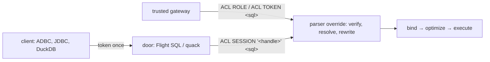

# Concepts

duckdb-acl is a DuckDB extension. It rewrites every statement a principal sends **before it is
bound**, then hands ordinary SQL to DuckDB's own binder, optimizer and executor. This page is the
model: how a statement reaches the rewrite, and what the rewrite does to it.

## Two ways in

- **A gateway** verifies the caller itself and puts the principal in front of each statement:
  - `ACL ROLE "<role>"` when the gateway already resolved the role;
  - `ACL TOKEN '<jwt>'` when the extension should verify the token offline;
  - `ACL ADMIN` for the gateway's own management statements.
- **A door** serves a client that connects for itself. The built-in Arrow Flight SQL server and the
  embedded quack server are doors. A door verifies the client's token once, opens a **session**, and
  prefixes every later statement with `ACL SESSION '<handle>'`.

A statement with no prefix is DuckDB's own. The deployment invariant is that only a gateway or a
door connects to DuckDB.

## Virtual catalogs

A principal never names a physical object. It names **virtual** ones: a catalog `c`, its schemas,
and its tables, views and functions. Each virtual object resolves to a physical one in any attached
database, or to a query.

- **RENAME** keeps the object a real table: `c.orders` becomes `phys.main.orders` in place, so
  `INSERT`, `UPDATE`, `DELETE` and `MERGE` work.
- **SUBQUERY** wraps a `SELECT`, and is read-only. It is used for a column list, a mask, a computed
  column, a row filter, or the body of a view or a virtual function.

A grant can mark one catalog as the role's **main** catalog. A role addresses the objects of its
main catalog unqualified. A principal whose roles name more than one main catalog must qualify every
name.

## Grants and capabilities

A role is granted a **catalog**, and optionally its **schemas** and **objects**. Each grant carries
capabilities.

- **The default.** A grant that states no capabilities holds every data capability: `select`,
  `insert`, `update`, `delete`, `merge`. An object grant that states none inherits its catalog
  grant's, so a refinement never widens by omission.
- **Explicit only.** The capabilities outside the default are held only when they are named, and are
  never inherited:
  - `create` / `drop` on a schema;
  - `temp` (session temp tables), `explain`, and `secrets` (the node's secrets service) on the main
    catalog grant;
  - `manage` (administer this catalog).
- **Predicates.** A grant's **RLS** predicate is AND-ed into every read and write. It is also
  checked against the row being written, so an `INSERT` or `UPDATE` cannot leave a row outside the
  principal's slice.
- **Columns.** A grant's **column list** narrows what the object exposes. A **mask** replaces a
  column's value, for example `ssn = NULL` or `email = left(email, 2) || '…'`. `DESCRIBE` and the
  listings describe what the role actually reads.
- **Claims.** Predicates and masks read the token's claims through `acl_claim('<name>')`. The
  claim's value is baked in as a constant, never passed as a query parameter.

## Functions

Every function call is judged by the **function gate**.

- **The key.** A function's key is `(database, schema, name, kind)`.
- **Categories.** A **category** is a named set of keys in the policy catalog. A call is admitted
  when its key is in a category granted to one of the principal's roles, or when the function is
  granted by name. A deny anywhere wins, and a key in no category is refused.
- **The shipped categories** hand ordinary SQL (`base`, `json`, `spatial`, …) to every role from the
  start. The readers (`read_csv`, `read_parquet`, …), the listings, the environment and the node's
  knobs need an explicit grant.
- **The never set.** `acl_*`, `query`, `json_execute_serialized_sql`, a scanner's `*_query`, and a few
  more are refused under any principal. This is code, and no grant re-opens it.
- **Qualified calls.** Every admitted call is emitted qualified to its key, so a macro named like a
  builtin cannot capture a principal's call.

## Administration

Administering the ACL is itself a capability.

- **Scopes.** `manage` on a catalog grant administers that catalog. A global `manage` or
  `passthrough` scope administers the whole policy. Only `passthrough` may run plain SQL outside the
  virtual catalog (`ACL NATIVE …`).
- **Syntax.** A principal writes management statements after the `ACL` marker, for example
  `ACL TOKEN '…' ACL GRANT CATALOG c TO ROLE r …`. The gateway's `ACL ADMIN …` is the anonymous form.
  Once a policy source is enabled, `ACL ADMIN` works only while `acl_allow_anonymous_admin` is on.

## Sessions and doors

A session is a verified token turned into a principal once. It ends when:

- it is closed;
- it has been idle for `acl_session_idle_timeout` seconds;
- an operator kills it;
- its token's `exp` passes, but only under the `every_use` binding.

The number of sessions is capped. At the cap a new session is refused; an old one is never evicted.
Doors add capacity controls on top:

- the quack door's seats;
- a node-wide stream memory budget;
- resource groups per role.

[Serving clients](serving.md) covers all of it.

## Where it is written down

Each feature has a short spec in the repository, under
[specs/](https://github.com/hugr-lab/duckdb-acl/tree/main/specs), and the core model is
[specs/001](https://github.com/hugr-lab/duckdb-acl/blob/main/specs/001-parser-override-ast-rewrite/spec.md).
These pages describe the behaviour. The specs record why it is that way.
